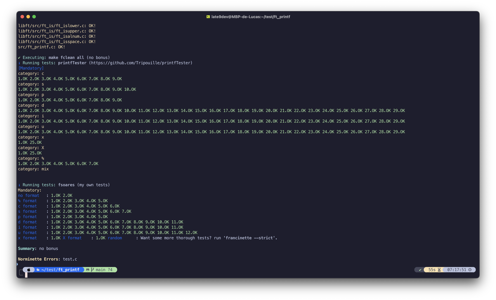

<h1 align="center">42 ft_printf</h1>

<picture>
  <source media="(prefers-color-scheme: dark)" srcset="./ressources/github-readme-banner-printf-light.png">
  <source media="(prefers-color-scheme: light)" srcset="./ressources/github-readme-banner-printf-dark.png">
  
</picture>

<p align="center">
	<b>
		<a href="#about">About</a>
		<span> · </span>
		<a href="#how-to-use">How to use</a>
		<span> · </span>
		<a href="#test">Test</a>
	</b>
</p>

<p align="center">
	
	
</p>

## About

`ft_printf` is a project at [42](https://42.fr) where students reimplement the C [printf](https://fr.wikipedia.org/wiki/Printf) function. This challenge emphasizes mastering [variadic functions](https://en.wikipedia.org/wiki/Variadic_function), string formatting, and deep C programming insights.

## How to use

### Clone the repository

I use my [libft](https://github.com/late9dev/42_libft.git) in this project. I  include it as a git submodules (it's like alias for git). That why i add the `--recurse-submodules` option.

```bash
git clone --recurse-submodules https://github.com/late9dev/42_printf.git ft_printf
```

```bash
cd ft_printf && make
```

### Create a test

```bash
vim test.c
```

```c
#include "ft_printf.h"

int	main(void)
{
	ft_printf("Hello World !\nMy name is %s.\nI'm %d.\n", "Lucas", 25);
	return (0);
}
```

### Compile & run

```bash
gcc -Wall -Wextra -Werror test.c -o test -L. -lftprintf && ./test
```

## Test

I passed all the mandatory [Francinette](https://github.com/xicodomingues/francinette) tests.



---

<div align="center">
	<i>By a Student of <a href="https://42.fr"><b>42 Paris</b></a>.</i>
</div>